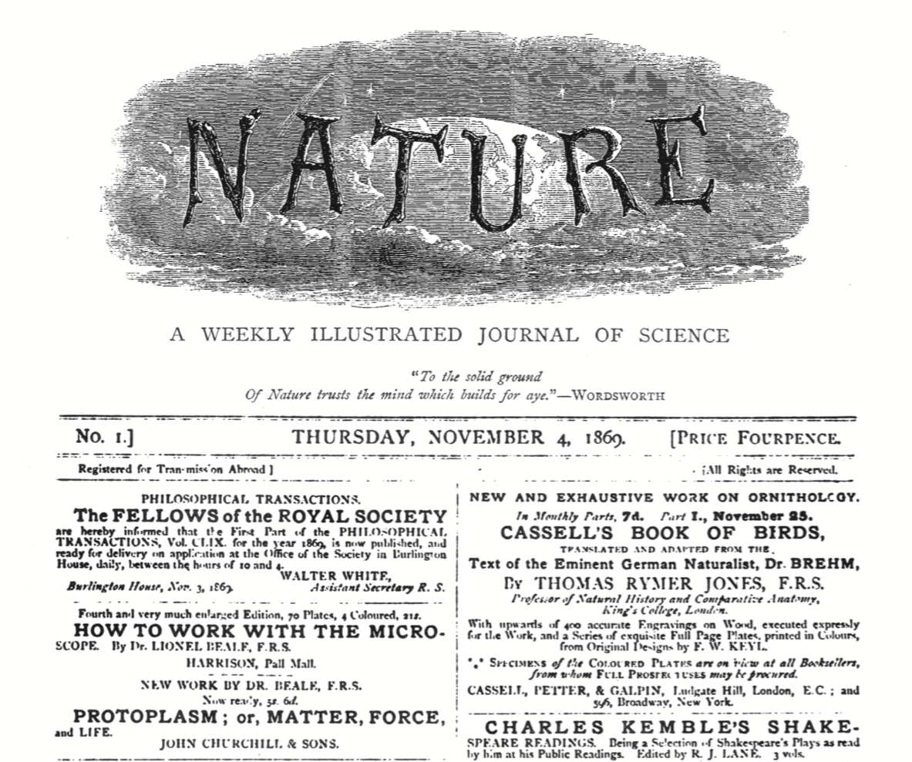

layout: true

background-image: url(https://patchwork.data-imaginist.com/reference/figures/logo.png)
background-position: 3% 97%
background-size: 8%

---

```{r setup, include=FALSE}
options(htmltools.dir.version = FALSE)
library(tidyverse)
library(patchwork)
library(medicaldata)
library(countdown)
```

```{r xaringan-themer, include=FALSE, warning=FALSE}
library(xaringanthemer)
style_duo(primary_color = "#F2D384" , 
                 secondary_color = "#174992",
  code_font_google   = google_font("Firacode")
)
```

```{r, echo=FALSE}
knitr::opts_chunk$set(warning = FALSE, message = FALSE, 
                      comment = NA)
```

---
class: center, top

# About Me

.left[
- Professor at the University of Michigan
- Clinical and research work in gastroenterology,<br>focused on Inflammatory Bowel Diseases
- Working (slowly) on an e-book written with {bookdown},<br> _Reproducible Medical Research with R_
]

---

class: center, top

# Inspiration
.pull-left[
.left[
- I wanted to make a typical scientific journal multipanel plot
  + This proved to be suprisingly difficult, as it was hard to add a typical chatty multipanel text legend at the bottom
- This started as an RStudio Community question
- lots of discussion, sent twitter batsignal to Claus Wilke
- Ended up on Stack Overflow, with a solve from Claus
- Here I am sharing the solution
]
]

```{r, echo = FALSE, out.height="30%", out.width="30%", fig.align='right'}

```

---

class: center, top

# Multipanel Plots

.left[
- Feel free to join in with the CRAN or dev versions
```{r, eval=FALSE}
install.packages("patchwork")
remotes::install_github("thomasp85/patchwork")
```
- make sure you have {tidyverse}, {patchwork}, and {ggtext} packages installed 
- library() all 3 packages
- Details at the {patchwork} packagedown site: <br>
https://patchwork.data-imaginist.com

- Take 60 seconds to install, library, and explore

```{r, echo=FALSE}
countdown(
  minutes = 1,
  play_sound = TRUE
)
```
]

---

class: inverse, center, middle

# Motivation for Multipanel Plots

---

class:  center, top

# Why Do This?

.left[
1. To group together conceptually-linked plots that explain different aspects of a dataset or experiment.

2. Because the high-impact journal that you want to publish in prefers printing on dead trees to HTML output, <br>and therefore only allows 5 figures per manuscript.

  + And they require a minimum of 20 figures worth of data for a manuscript to be worthy of being sent out for review. 

  + So you are going to jam 20 figures into 5 multipanel plots, for complicated reasons involving promotion and tenure.

3. Did I mention that the academic-journal-industrial complex is an unfortunate relic of the 1870s?
]

```{r, echo = FALSE, out.height="20%", out.width="20%", fig.align='center'}

```


---

class:  center, top

## What Patchwork Can Do For You
.left[
- Start with Single (related) Plots
- Use a simple user interface to combine them
- Arrange at will in rows and columns
- Nesting included
]
---

class:  center, top

## Preparing data for 4 dummy plots
.left[
```{r, echo=TRUE}
# Library calls
library(tidyverse)
library(ggtext)
library(patchwork)

# make dummy figures
d1 <- runif(500)
d2 <- rep(c("Treatment", "Control"), each=250)
d3 <- rbeta(500, shape1=100, shape2=3)
d4 <- d3 + rnorm(500, mean=0, sd=0.1)
plotData <- data.frame(d1, d2, d3, d4)
```
]
---

class:  center, top

## Single Plots, Plot 1 through Plot 4
.left[
```{r p1, eval=FALSE}
p1 <- ggplot(data=plotData) + 
  geom_point(aes(x=d3, y=d4)) + labs(tag = "A") +
  theme(plot.background = 
          element_rect(color='black'))

p2 <- ggplot(data=plotData) + geom_boxplot(aes(x=d2, y=d1, fill=d2))+
  theme(legend.position="none") + labs(tag = "B") +
  theme(plot.background = element_rect(color='black'))

p3 <- ggplot(data=plotData) +
  geom_histogram(aes(x=d1, color=I("black"), fill=I("orchid"))) + labs(tag = "C") +
  theme(plot.background = element_rect(color='black'))

p4 <- ggplot(data=plotData) +
  geom_histogram(aes(x=d3, color=I("black"), fill=I("goldenrod"))) + labs(tag = "D") +
  theme(plot.background = element_rect(color='black'))
```
]

---

class: center, top
# Panel A: Scatterplot
.pull-left[
```{r plot1, eval = FALSE}
ggplot(data=plotData) + 
  geom_point(aes(x=d3, y=d4)) + 
  labs(tag = "A") +
  theme(plot.background = 
          element_rect(color='black'))
```
]

.pull-right[
```{r plot1-out,  echo = FALSE}
ggplot(data=plotData) + 
  geom_point(aes(x=d3, y=d4)) + 
  labs(tag = "A") +
  theme(plot.background = 
          element_rect(color='black'))
```
]


---
class:  center, top

## Panel B: Boxplot
.pull-left[
```{r, eval=FALSE}
ggplot(data=plotData) + 
  geom_boxplot(aes(x=d2, y=d1, fill=d2))+ 
  labs(tag = "B") +
  theme(legend.position="none") +
  theme(plot.background = 
          element_rect(color='black'))
```
]

.pull-right[
```{r, echo=FALSE}
ggplot(data=plotData) + 
  geom_boxplot(aes(x=d2, y=d1, fill=d2))+ 
  labs(tag = "B") +
  theme(legend.position="none") +
  theme(plot.background = element_rect(color='black'))
```
]

---

class:  center, top

## Panel C: Orchid Histogram
.pull-left[
```{r , eval=FALSE}
ggplot(data=plotData) +
  geom_histogram(aes(x=d1, color=I("black"), 
                     fill=I("orchid"))) + 
  labs(tag = "C") +
  theme(plot.background = 
          element_rect(color='black'))
```
]

.pull-right[
```{r, echo=FALSE}
ggplot(data=plotData) +
  geom_histogram(aes(x=d1, color=I("black"), 
                     fill=I("orchid"))) + 
  labs(tag = "C") +
  theme(plot.background = 
          element_rect(color='black'))
```
]
---

class:  center, top

## Panel D: Goldenrod Histogram
.pull-left[
```{r, eval=FALSE}
ggplot(data=plotData) +
  geom_histogram(aes(x=d3, color=I("black"), 
                     fill=I("goldenrod"))) + 
  labs(tag = "D") +
  theme(plot.background = 
          element_rect(color='black'))
```
]
.pull-right[
```{r, echo=FALSE}
ggplot(data=plotData) +
  geom_histogram(aes(x=d3, color=I("black"), fill=I("goldenrod"))) + labs(tag = "D") +
  theme(plot.background = element_rect(color='black'))
```
]

---

class: inverse, center, middle

## Now Combine These Plots into a Multipanel Plot<br>with {patchwork}

---

class:  center, top

## Use  |  to Combine Plots in a row!
```{r, fig.height=4, fig.width=10}
p1 | p2 | p3 | p4
```

---

class:  center, top

## Use  /  to Combine Plots in a Column!
```{r, fig.height=6, fig.width=3}
p1 / p2 / p3 / p4 
```
---

class:  center, top

## Use  +  to Combine Plots in a 2 x 2 Grid!
```{r, fig.height=6, fig.width=6}
p1 + p2 + p3 + p4
```
---

class:  center, top

## Make More Complex Multipanel Plots with Nesting!
```{r, fig.height=6, fig.width=10}
p1 / (p2 | (p3/p4))
```

---

class:  center, top

## Code-Along Break for Patchwork
.left[
- Look up the patchwork packagedown website
- https://patchwork.data-imaginist.com/
- Review the guides
- Try it out with plots p1 - p4
- Be creative with (), / , |, and plot_layout()
- Take 3 minutes to arrange some plots
]
```{r, echo=FALSE}
countdown(
  minutes = 3,
  play_sound = TRUE
)
```
---
class:  center, top

## This is Great, but How to Add a Combined Legend?
```{r, fig.height=6, fig.width=10, echo=FALSE}
(p1) / (p2 | (p3/p4))
```

---

class: inverse, center, middle

## The Quest to Add a Combined Legend

---

class: inverse, center, middle

## The Side-Quest into {ggtext}:<br>This Turns Out to Be Part of the Solution!

---

class:  center, top

## The {ggtext} package
.left[
- Packagedown site at https://wilkelab.org/ggtext/ 
- allows HTML tag formatting or markdown formatting of text within ggplots!
- color, italics, bold, images, boxes, superscripts
- Can be used in axis labels, legend text, annotations, tick labels
- uses element_markdown() or element_textbox() in place of element_text()
- multi-line labels with `<br>`
- can use inline CSS properties including color, font-size, and font-family
]
---

class:  center, top

## Failed Attempts
.left[
- With a TextGrob - bad
- with a {ggtext} caption - not great
- with a {ggtext} textbox_grob - closer
  - Odd spacing
  - Turns out each row set to equal height
- with a {ggtext} plot_annotation - very close!
]

---

class:  center, top

## Code and Image - {ggtext} plot_annotation 
.pull-left[
```{r, eval = FALSE}
fig_legend <- plot_annotation(
  caption = "**Figure 1.**  Testing Control vs. Treatment.   A. Scatterplot. 
  B. The outcomes in the control arm were significantly better than 
  the Treatment Arm. C. Histogram. D. Another Histogram.",
  theme = theme(
    plot.caption = element_textbox_simple(
      size = 11,
      box.colour = "black",
      linetype = 1,
      padding = unit(c(3, 3, 3, 3), "pt"),
      r = unit(0, "pt")  )  ) )
p1 + {
  p2 + {
    p3 +
      p4 +
      plot_layout(ncol=1)
  }
} + fig_legend +
  plot_layout(ncol=1)
```
]

.pull-right[
```{r, echo = FALSE}
fig_legend <- plot_annotation(
  caption = "**Figure 1.**  Testing Control vs. Treatment.   A. Scatterplot. 
  B. The outcomes in the control arm were significantly better than 
  the Treatment Arm. C. Histogram. D. Another Histogram.",
  theme = theme(
    plot.caption = element_textbox_simple(
      size = 11,
      box.colour = "black",
      linetype = 1,
      padding = unit(c(3, 3, 3, 3), "pt"),
      r = unit(0, "pt"))  ))
p1 + {
  p2 + {
    p3 +
      p4 +
      plot_layout(ncol=1)
  }
} + fig_legend +
  plot_layout(ncol=1)
```
]
---


class:  center, top

## Now Add the Legend - with a {ggtext} plot_annotation 
.left[
- Very close, but funky margins (narrower plot_annotation)
- turns out that this inherits margins from plot margins above - now applied to the caption
- can assign negative left and right margins (5.5 pt) to counteract the default plot margins.
]
---

class:  center, top

## Now Add the Legend - Attempt 5 - Solution!
.left[
- With negative left and right margins (5.5 pt) 
]
```{r, eval = FALSE}
fig_legend <- plot_annotation(
  caption = "**Figure 1.**  Testing Control vs. Treatment.   A. Scatterplot. 
  B. The outcomes in the control arm were significantly better than 
  the Treatment Arm. C. Histogram. D. Another Histogram.",
  theme = theme(
    plot.caption = element_textbox_simple(
      size = 11,
      box.colour = "black",
      linetype = 1,
      padding = unit(c(3, 3, 3, 3), "pt"),
      margin = unit(c(0, -5.5, 0, -5.5), "pt"), #<<
      r = unit(0, "pt")  ) ) )

p1 + {
  p2 + {
    p3 + p4 + plot_layout(ncol=1)}} + 
  fig_legend +
  plot_layout(ncol=1)
```

---

class:  center, top

## Now Correct Width Legend - Achievement Unlocked!

```{r, echo = FALSE}
fig_legend <- plot_annotation(
  caption = "**Figure 1.**  Testing Control vs. Treatment.   A. Scatterplot. 
  B. The outcomes in the control arm were significantly better than 
  the Treatment Arm. C. Histogram. D. Another Histogram.",
  theme = theme(
    plot.caption = element_textbox_simple(
      size = 11,
      box.colour = "black",
      linetype = 1,
      padding = unit(c(3, 3, 3, 3), "pt"),
      margin = unit(c(0, -5.5, 0, -5.5), "pt"), 
      r = unit(0, "pt")  ) ) )

p1 + {
  p2 + {
    p3 + p4 + plot_layout(ncol=1)}} + 
  fig_legend +
  plot_layout(ncol=1)
```

---

class:  inverse, center, top

## Lessons Learned
.left[
- The #rstats community is awesome
- Use {reprex} to ask questions on RStudio Community and Stack Overflow
- Lots of people are willing to help if you can come up with a *minimal* reproducible example and<br>can state your question (and your end goal) clearly
]
---

class:  center, top

# Links to RStudio Community and StackOverflow Discussions

<br><br>
[RStudio Community](https://community.rstudio.com/t/plot-in-a-box-with-long-text-legend-in-a-box/51962)
<br>
https://community.rstudio.com/t/plot-in-a-box-with-long-text-legend-in-a-box/51962
<br>

[Stack Overflow](https://stackoverflow.com/questions/60142452/multipanel-plots-with-spanning-figure-legend-in-r-with-ggtext-and-gridtext-in-r)
<br>
https://stackoverflow.com/questions/60142452/multipanel-plots-with-spanning-figure-legend-in-r-with-ggtext-and-gridtext-in-r
